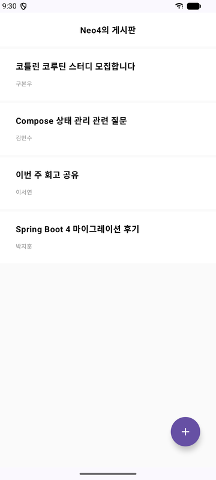
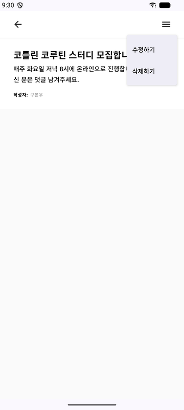
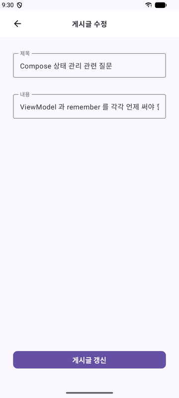
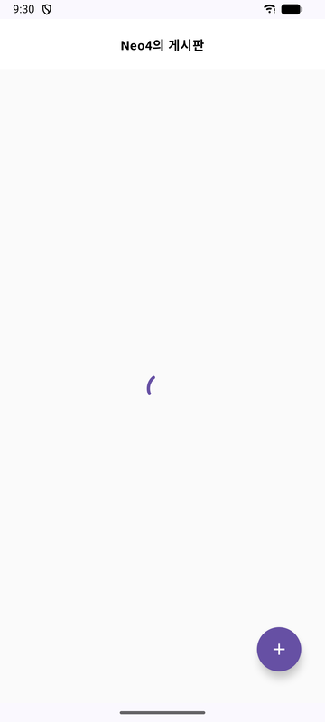
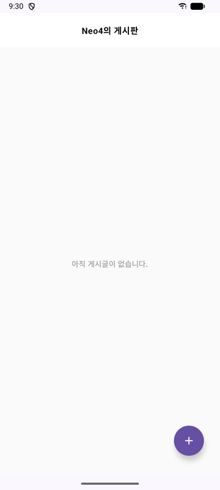
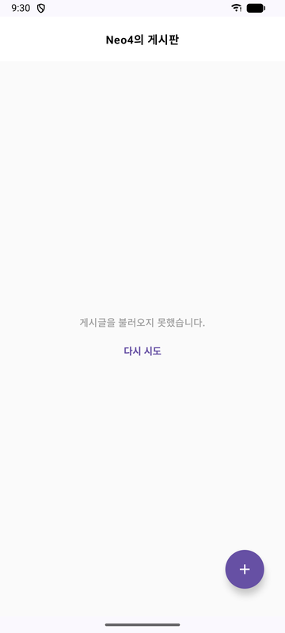

# compose-board-app

Jetpack Compose로 만든 게시판 안드로이드 앱.
[kotlin-board-api](https://github.com/BonuKoo/kotlin-board-api) 서버와 HTTP로 연동합니다.


| 목록 | 상세 | 수정 |
|:---:|:---:|:---:|
|  |  |  |

불러오는 중 · 게시글 없음 · 요청 실패를 각각 구분해 표시하고, 실패 시 재시도할 수 있습니다.

| 불러오는 중 | 게시글 없음 | 요청 실패 |
|:---:|:---:|:---:|
|  |  |  |


---

## 프로젝트 소개

게시글의 생성 · 목록 조회 · 단건 조회 · 수정 · 삭제를 제공하는 안드로이드 클라이언트입니다.
서버도 함께 만들어, 앱과 API를 양쪽에서 설계하고 HTTP로 잇는 과정을 익히려고 시작했습니다.

**중점을 둔 것**

- Compose 선언형 UI와 화면 상태를 타입으로 모델링하기
- ViewModel 중심의 상태 관리 — 화면 회전과 생명주기 대응
- 계층 분리와 의존성 주입으로 테스트할 수 있는 구조 만들기
- 별도 리포지토리로 관리되는 서버와 HTTP 계약 맞추기

---

## 구조

| 구성 요소 | 책임 |
|---|---|
| `BoardApp` | `NavHost` 구성, 화면 간 라우팅 |
| `BoardListScreen` | 목록 조회 및 표시 |
| `ShowBoardScreen` | 단건 조회, 수정·삭제 메뉴 |
| `CreateBoardScreen` | 작성 폼 |
| `UpdateBoardScreen` | 수정 폼 |

---

## 서버 연동

`BoardService`의 메서드는 모두 코루틴 `suspend` 함수입니다.

| BoardService | Method | Endpoint |
|---|---|---|
| `createBoard` | `POST` | `/board` |
| `getBoardList` | `GET` | `/board` |
| `getBoardById` | `GET` | `/board/{id}` |
| `updateBoard` | `PATCH` | `/board` |
| `deleteBoard` | `DELETE` | `/board/{id}` |

통신 모델 `RequestBoard`는 서버의 `BoardDto`와 필드가 1:1로 대응하고,
화면용 모델 `Board`로의 변환은 `RemoteBoardRepository`가 맡습니다.

| RequestBoard | Board | 타입 |
|---|---|---|
| `id` | `id` | `Int` |
| `title` | `title` | `String` |
| `content` | `content` | `String` |
| `name` | `writer` | `String` |

---

## 실행

서버 주소는 `local.properties`에서 읽어 `BuildConfig.SERVER_BASE_URL`로 주입됩니다.
이 파일은 버전 관리에서 제외되므로 개발 환경마다 값을 따로 둡니다.

```properties
server.base.url=http://000.000.0.00:8080 - 도메인 / 각 PC의 IP 입력
```

값이 없으면 에뮬레이터 기본 주소 `http://10.0.2.2:8080`을 사용합니다.
실기기·에뮬레이터는 `localhost`를 인식하지 못하므로 서버가 실행 중인 PC의 LAN IP를 지정하고,
그 PC의 방화벽에서 8080 포트 인바운드를 허용해야 합니다.

평문 HTTP 통신을 위해 `AndroidManifest.xml`에 `usesCleartextTraffic="true"`가 설정되어 있습니다.

---

## 테스트

| 대상 | 개수 | 확인하는 것 |
|---|---|---|
| `BoardListViewModelTest` | 6 | 로딩·성공·빈 목록·실패, 재시도 복구, 재조회 시 화면 깜빡임 없음 |
| `CreateBoardViewModelTest` | 4 | 입력 반영, 등록 성공, 연타 시 1회만 전송, 실패 후 재시도 |
| `UpdateBoardViewModelTest` | 5 | 값 채움, 조회 실패 시 저장 차단, 제목·내용만 변경, 재조회 시 입력 보존 |

---

## 개선 이력

계층을 나누는 과정에서 찾아 고친 버그와 구조 변경 기록은
[docs/IMPROVEMENTS.md](docs/IMPROVEMENTS.md)에 별도로 정리해 두었습니다.
